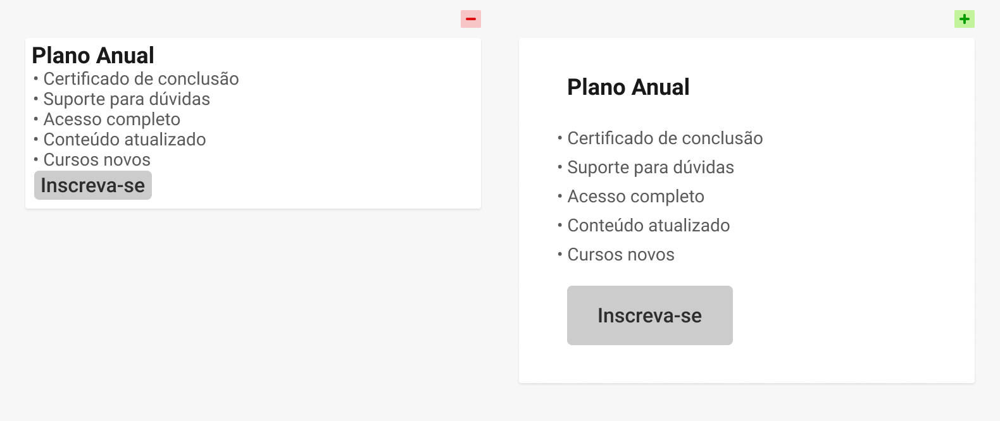
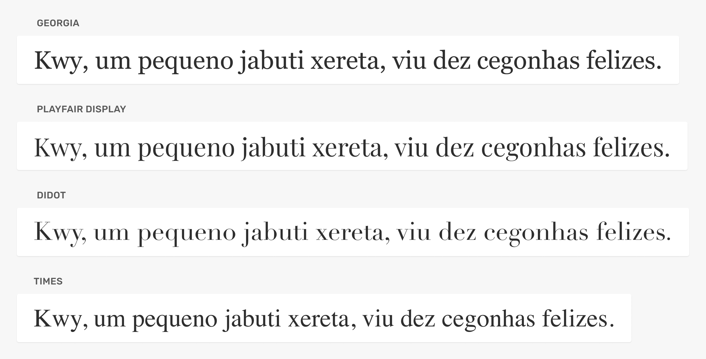
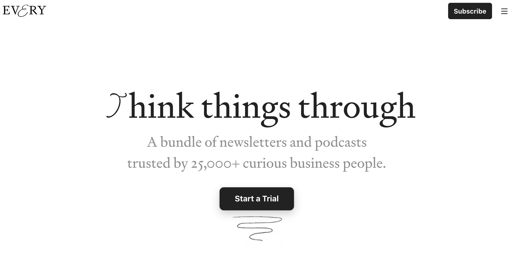
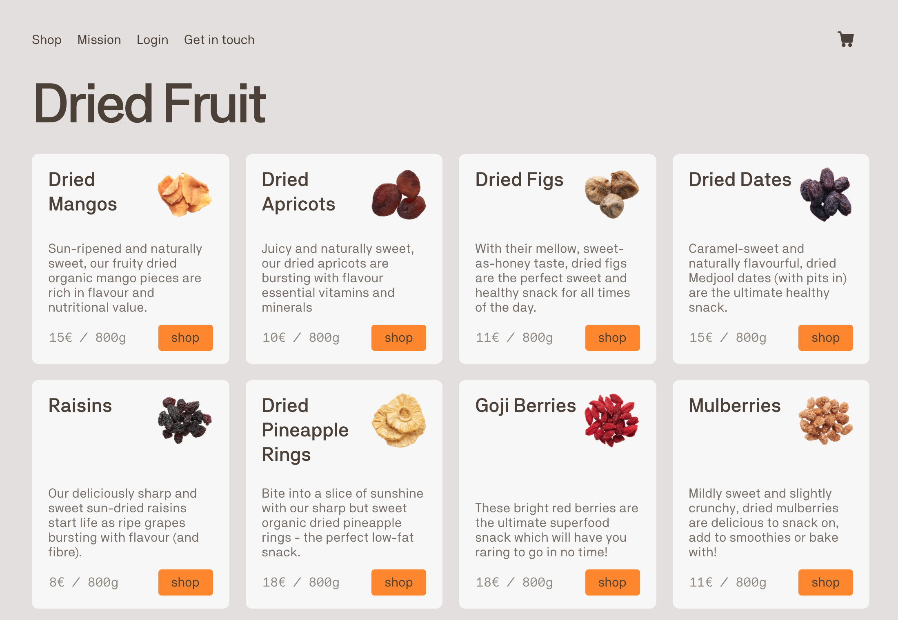

# UI Design

## Espaço
O principal uso do espaço é para definirmos uma relação lógica entre os nossos elementos. Com os espaços podemos:

* Agrupar e separar elementos

* Definir hierarquia

* Organizar informação (Grid)

* Espaço para respirar

## Agrupar e separar
Espaços menores agrupam elementos relacionados. O conceito de espaço maior/menor é relativo aos demais elementos da página.

Espaços maiores separam componentes.

Exemplo:

https://airgarden.com.au/

## Definir hierarquia
Com o espaço podemos definir a ordem de importância dos elementos.

Definir hierarquia

Exemplo:

https://leafshave.com/

## Grid
O grid é uma malha invisível que serve para posicionarmos os elementos com um alinhamento lógico. Você não precisa ficar restrito ao grid definido, quebras do grid são bem vindas para a criação de contraste.

O grid do site Ramp utiliza uma base de 12 colunas e o conteúdo é organizado dentro das mesmas.

https://ramp.com/

## Respirar
Crie espaço entre o conteúdo e a sua borda para permitir que o mesmo respire.

Exemplo:

https://pleaserepeat.com/

Recomendação de livro: Design para quem não é designer:Princípios de Design e Tipografia Para iniciantes

## Tipografia
"Web Design é 95% tipografia"

iA - 2006

### Classificações

* Serifadas, sem serifas, monoespaçadas, cursivas e decorativas.

### Famílias

* Arial, Helvetica, Georgia, Futura, Roboto e outras.

### Fontes

* Georgia Regular, Georgia Bold, Georgia Italic e outras.

## Serifadas
As serifadas (serif) são caracterizadas pelos pequenos detalhes nas extremidades dos caracteres.

### Estilo

* Formal, clássico, luxo, literário e manual.

### Uso

* Corpo de texto e títulos.

Every utiliza serifadas nos títulos e corpo de texto, uma boa escolha para um site focado em escritores/leitores.

https://every.to/

## Sem Serifas
As sem serifas (sans serif) são caracterizadas pelas suas formas neutras e pela ausência das serifas.

#### Estilo

* Neutro, digital, objetivo e informal.

### Uso

* Corpo de texto, títulos e texto funcional (botões, links, abas).

A marca Moy comunica objetividade através do uso de tipografias neutras e sem serifas em toda a interface.

https://www.moy.is/

## Monoespaçadas
As monoespaçadas (monospace) possuem todos os seus caracteres com a mesma largura, permitindo que linhas de texto se alinhem perfeitamente uma abaixo da outra.

### Estilo

* Digital, objetivo e técnico.

### Uso

* Dados, tabelas e código.

Tipografia monoespaçada é utilizada na interface do Github para mostrar o código dos arquivos. Os outros elementos da interface utilizam uma tipografia sem serifa.

https://github.com/

## Cursiva
As tipografias cursivas (script/handwriting) tentam imitar a escrita ocidental com formas orgânicas e geralmente ligadas entre si.

### Estilo

* Manual e celebrações.

### Uso

* Títulos e pequenos textos.

O site Bide utiliza tipografia cursiva para nomes no texto principal.

https://www.bidemarket.com/

## Decorativas
Tipografias decorativas (display) são todas aquelas que possuem características fortes que as tornam distintas de qualquer outra tipografia. Elas podem dar vida ou arruinar um projeto.

### Estilo

* Site temático.

### Uso

* Títulos e pequenos textos.

O site Drink Monday utiliza uma tipografia que lembra o estilo art nouveau em contraste com o estilo art déco da marca Monday.

https://drinkmonday.co/

## Famílias
O desenho de uma tipografia feito por um designer de tipos define uma família tipográfica. As famílias tipográficas são as mais variadas possíveis e geralmente possuem influências históricas.

Quando um designer cria uma família tipográfica que possui diferentes classificações, temos uma super família.

## Fontes
A família tipográfica é composta por diferentes fontes que podem variar desde o peso (regular/bold) ao estilo (oblique/italic). A fonte é o arquivo final.

Além de estilos pré-definidos pelo designer de tipos, hoje em dia existem também fontes variáveis que te permitem criar fontes com um ajuste mais fino: https://web.dev/variable-fonts/

Toda fonte possui a sua classificação, família e peso.

## Contraste

* O uso de diferentes fontes facilita a criação de contraste entre os elementos.

## Famílias

* Evite utilizar famílias parecidas e se limite ao uso de duas diferentes (iniciantes).

Apesar da Roboto (corpo de texto) e Poppins (título, lista e botão) serem ambas sem serifas, a Poppins é uma geométrica e possui características diferentes o suficientes para criar contraste entre as mesmas.
